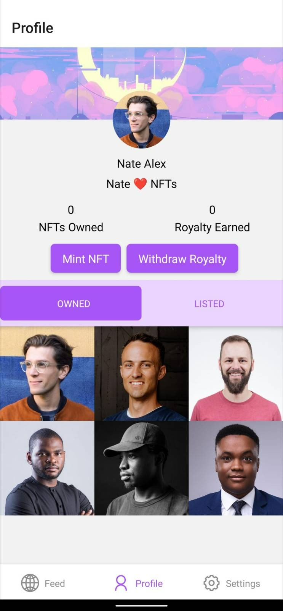
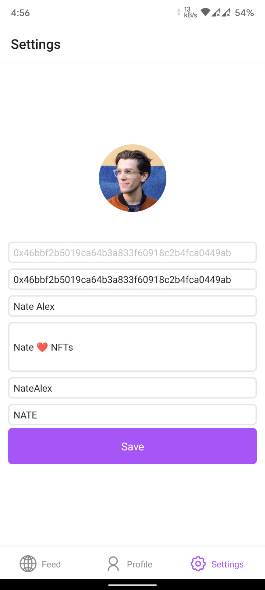

# DAOMe

### DAOMe is a No-code Creator Economy platform.
[Demo Video](https://www.youtube.com/watch?v=VZGs_hDdqnY)

The problem DAOMe solves

-   Marketplaces like Opensea are not Completely trustless.
    NFTs created using Opensea exists on Opensea StoreFront Contract which is closed source.
-   Setting up Snapshot, Discourse and DAO infrastructure is cumbersome.
-   DAOMe solves this problem all the NFTs created on the DAOMe Platform all 100% owned by the creator.
-   DAOMe solves all this problems by providing a No-Code solution and making Web3 more accessible to the masses.

